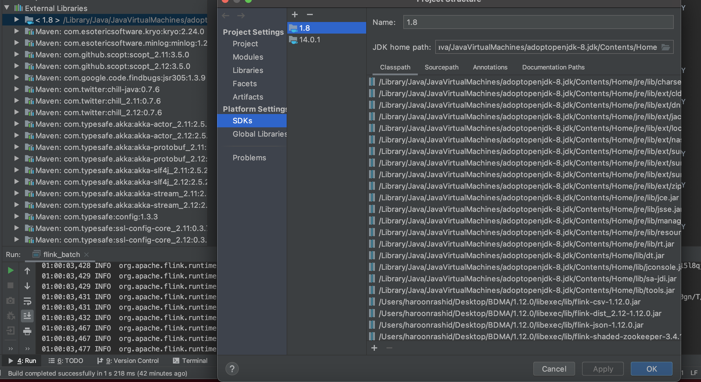
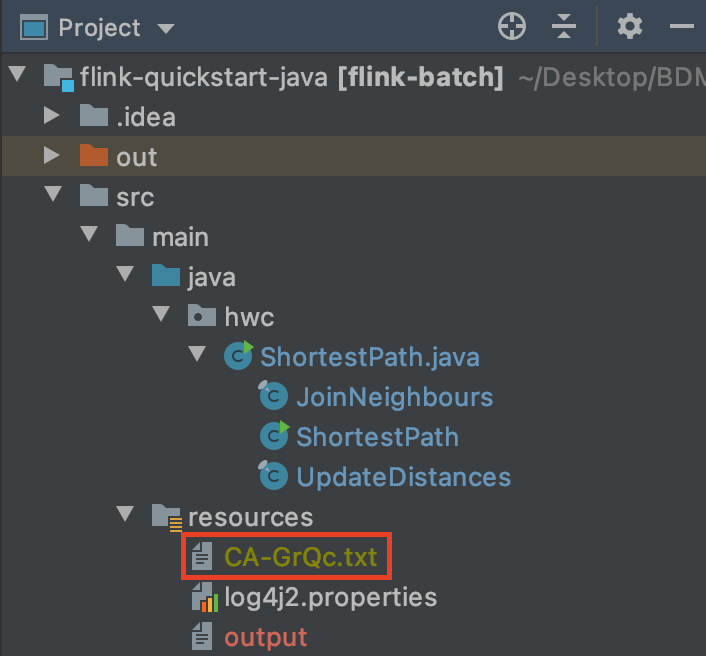
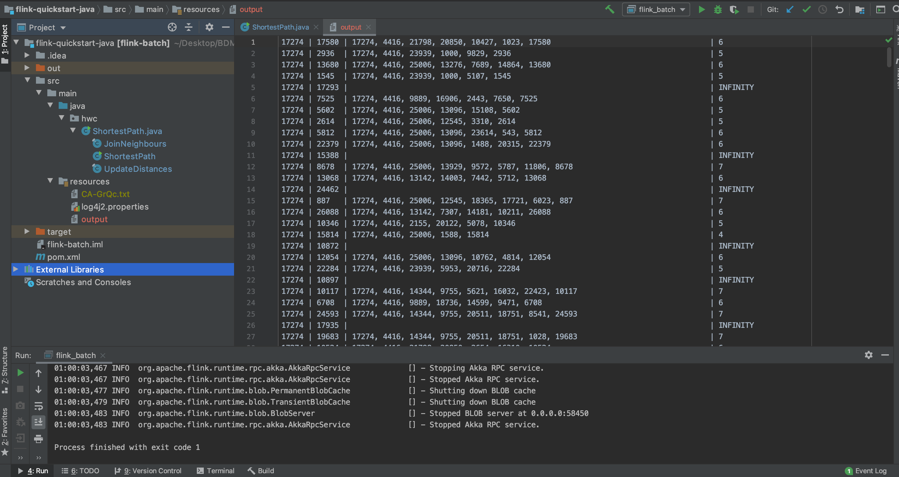

<h2> C: Flink Batch Processing </h2>

<h3>Setting up the Environment</h3>

1. Download Flink from the Website  

2. Start the Flink cluster by running the bash script in the flink bin directory.   

3. Import 
HW1_Rashid/src/C/flink-quickstart-java in IntelliJ  

4. Add Flink JAR files to the External Libraries  

5.Make sure that ca-GrQc.txt is in src/main/resources/ dir.  

<h3> Running the exercises </h3>

 Run the Green Play Button on IntelliJ to execute the program 

<h3> Output </h3>

The output saved on the following path:

`src/main/resources/output`

